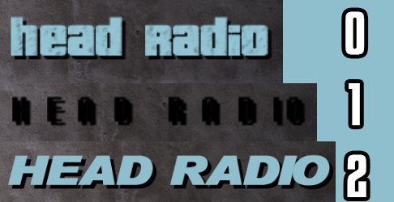

## **AUTHOR:** _WastedHymn_
## **DATE:** _06.03.2023_

 

## **REQUIREMENTS**
• **CLEO Redux** and **ULTIMATE ASI LOADER**.

 

## **INSTALLATION**
• Select the "**radioStatonFontChanger[mem].js**" file that suits **your game version** (game versions like "D3D9 x64, OpenGL x64 or D3D9 MSS x86").  
• Paste the file into the **CLEO** folder(../Grand Theft Auto 3 Install Location/CLEO).

 

## **CONTROLS**
• Use **"Page Up"** and **"Page Down"** keys to cycle through fonts.

 

## **SCREENSHOT**

