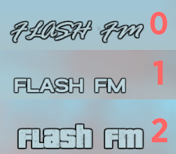

- **AUTHOR:** _WastedHymn_
- **DATE:** _15.02.2023_
- **INFO:** This script is based on ThirteenAG's script.  
 **Source Code:** https://github.com/ThirteenAG/III.VC.SA.CLEOScripts/blob/master/gtavc/VC.VCSRadioFont.txt  
 **ThirteenAG Github Profile:** https://github.com/ThirteenAG/III.VC.SA.CLEOScripts/blob/master/gtavc/VC.VCSRadioFont.txt
### **INSTALLATION**

- Download **radioStationFontChanger[mem].js** file.
- Paste the file and the folder into the "CLEO" ("**..\GTA Vice City Definitive Edition Install Location\Gameface\Binaries\Win64\CLEO**").

### **CONTROLS**

- Use "**Page Up**" and "**Page Down**" keys to cycle through fonts.

### **SCREENSHOT**

### **THANKS TO**

- **[_SEEMANN_](https://github.com/x87) FOR CLEO REDUX**
- **CLEO MOODING COMMUNITY [_DISCORD_](https://discord.gg/d5dZSfgBZr)**
